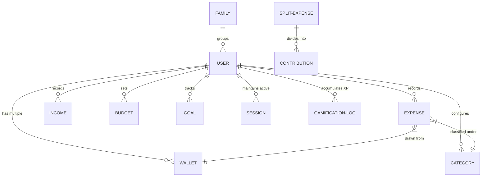

# Expense Tracker System Architecture (MERN Stack)

## Overview

This project is built on a **3-tier MERN architecture** scaled for advanced personal finance capabilities, gamification, and security.

``` text
       +-----------------------------------------------------+
       |               React Frontend (Client)               |
       |  - React 18, Vite, React Router v6, Tailwind CSS    |
       |  - State: Context API & TanStack React Query        |
       |  - Visuals: Recharts & Framer Motion animations     |
       +--------------------------+--------------------------+
                                  |
                      HTTPS / REST API Requests
                                  |
       +--------------------------v--------------------------+
       |               Node.js + Express API Server          |
       |  - Controllers, Routes, & Joi Input Validation      |
       |  - Double JWT: Auth Headers + Secure Refresh Cookie |
       |  - Multi-level Security Middlewares & Winston Logs  |
       +--------------------------+--------------------------+
                                  |
                             Mongoose ODM
                                  |
       +--------------------------v--------------------------+
       |                 MongoDB Database                    |
       |  - 21 Collections representing accounts, wallets,    |
       |    challenges, goals, budgets, and sessions         |
       +-----------------------------------------------------+
```

---

## 💻 Frontend Architecture (React)

The frontend is built as a single-page application (SPA) optimized for fast caching, secure token rotation, and highly visual interfaces.

### Core Stack
*   **Vite**: Next-generation frontend tooling.
*   **React Router v6**: Client-side declarative routing.
*   **Axios**: HTTP client featuring interceptors to catch expired short-lived access tokens and trigger silent refreshes using HttpOnly cookies.
*   **TanStack React Query**: Synchronizes client state with the server, providing out-of-the-box caching, background fetching, and query invalidation.
*   **Framer Motion**: Leveraged for modern dashboard widgets, transaction table transitions, level-up card modals, and gamification feedback.
*   **Recharts**: Powers financial data visualizations, progress gauges, reports, and spend forecast analytics.

### Global Context Providers (`client/src/context/`)
*   **AuthContext**: Handles user state, JWT access token cache, registration, login, and active session logout.
*   **ExpenseContext**: Caches transaction records, custom filters, pagination, and multi-wallet balance states.
*   **GamificationContext**: Manages XP progression, current level, level-up modal triggers, and daily challenge checks.
*   **ThemeContext**: Controls dark/light modes and glassmorphic UI variables.
*   **DialogContext**: Manages state of global overlays, modals (e.g., Reward Chests, notifications, alerts).

### UI Pages & Modules
*   **Auth**: Secure register and login.
*   **Dashboard**: High-level spending gauges, wallet totals, and recent transaction panels.
*   **Income & Expenses**: Full CRUD logs with advanced search, categorizations, and paginated lists.
*   **Wallets**: Multi-wallet support (e.g., Cash, Bank, Cards) with balance tracking.
*   **Budget**: Monthly budget limit indicators per category with threshold notifications.
*   **Reports & Analytics Pro**: Spending patterns, forecast analytics, and trend lines.
*   **Goals**: Target savings milestones (e.g., emergency funds) with progress metrics.
*   **Calendar**: Bill calendar interface mapping out upcoming/overdue payments.
*   **Subscriptions**: Active services tracker mapping monthly schedules.
*   **Split Bills**: Group expense splitter managing settlement metrics.
*   **Family Sharing**: Joint family budget rooms with invited users.
*   **AIAssistant**: Conversational interface with Gemini AI for financial planning.
*   **Achievements**: XP leaderboard, daily goals, and progress badges.
*   **Admin**: Administrative dashboard inspecting system performance and logs.

---

## ⚙️ Backend Architecture (Express API)

The backend is built with Express.js following a clean Controller-Service-Repository architecture pattern.

### API Routes Configuration

```text
/api
 ├── /auth            --> Register, Login, Refresh token, Active session invalidation
 ├── /users           --> Profile settings, XP levels, Active sessions audit log
 ├── /income          --> CRUD for income streams
 ├── /expenses        --> CRUD for expenses
 ├── /categories      --> Default categories seeding & user custom categories
 ├── /budgets         --> Monthly limits & alerting
 ├── /reports         --> Analytical aggregations, CSV / Excel / PDF statement generation
 ├── /wallets         --> Accounts creation & balance recalculations
 ├── /goals           --> Savings goals & progress logs
 ├── /investments     --> Investment logs (stocks, bonds, real estate)
 ├── /loans           --> Debt logs (lent & borrowed records)
 ├── /subscriptions   --> Recurring bill schedules
 ├── /notifications   --> User notifications history
 ├── /ai              --> Google Gemini chat assistant with caching
 ├── /split-bills     --> Split bills and contributions
 ├── /family          --> Family group parameters
 ├── /admin           --> Global stats and debug tools
 ├── /sessions        --> Multi-device session details
 ├── /analytics       --> Spend forecast regression models
 ├── /dashboard       --> Combined widget responses
 ├── /gamification    --> XP logging & badge verification
 └── /bills           --> Recurring and scheduled bills
```

### Security & Sanitization Middlewares
*   **Helmet**: Secures the application by setting various HTTP response headers.
*   **CORS Configuration**: Dynamic validation of requests against client domain white-lists (including support for Vercel preview domains in development).
*   **Express Rate Limit**: Implements tiered request limits across different layers (global API throttle, strict login attempts throttle, OTP request throttle).
*   **Mongo Sanitize**: Sanitizes user inputs to neutralize MongoDB Query Injection attacks.
*   **xssSanitizer**: Custom parser that recursively strips Javascript payloads from request bodies, URL params, and query strings.
*   **HPP (HTTP Parameter Pollution)**: Protects against parameter pollution attacks by sanitizing array query inputs.
*   **Error Handler**: Centrally catches all async errors, formats standard responses, and ensures stack traces are never exposed in production.

---

## 🗄️ Database Architecture (MongoDB)

All data models are defined using Mongoose schemas in `server/models/`.

### Schema Map & Key Fields
*   **User**: Details, password hash, verification status, active role (admin/user), level, XP, avatar.
*   **Wallet**: Name, type (bank/cash/card), currency, balance, color, icon, isPrimary.
*   **Category**: Name, icon, color, type (income/expense), user reference.
*   **Expense / Income**: Amount, wallet, category, user, date, description, tags, receiptImage.
*   **Budget**: User, category, limit, period (monthly), spentAmount, lastAlertSent.
*   **Goal**: User, name, targetAmount, currentAmount, deadline, status (active/completed).
*   **Session**: User, token hash, deviceName, browser, OS, IP address, isActive, lastActive.
*   **GamificationLog**: User, action (expense_logged, budget_met), xpGained, referenceId.
*   **DailyChallengeCompletion**: User, challengeType, dateCompleted.
*   **Family**: Name, creator, members (array of user references), inviteCode.
*   **SplitExpense**: Group name, totalAmount, paidBy, contributions (array of split amounts).
*   **Subscription**: User, name, amount, billingCycle, nextPaymentDate, category.
*   **AIChat**: User, messages (role, content, timestamp), promptTokens, responseTokens.

### Relationship Models



---

## 📂 Project Directory Structure

```text
expense-tracker/
├── client/
│   ├── src/
│   │   ├── components/       # Reusable components (forms, modal overlays, loaders)
│   │   ├── constants/        # Application-wide constants (currencies, layout themes)
│   │   ├── context/          # Context API Providers (Auth, Expenses, Gamification)
│   │   ├── hooks/            # Custom hooks (useMediaQuery, useDebounce)
│   │   ├── pages/            # View components (Dashboard, Split, AI Assistant)
│   │   ├── services/         # Axios API modules (authService, expenseService)
│   │   ├── utils/            # Helper functions (currency formatter, date parsers)
│   │   ├── App.jsx           # Routing paths & provider wrapper
│   │   └── main.jsx          # DOM entry point
│   ├── package.json          # Client-side configuration
│   └── tailwind.config.js    # Tailwind layout settings
│
├── server/
│   ├── config/               # Database connection (`db.js`) & Env schemas (`env.js`)
│   ├── controllers/          # Business logic handlers mapped to routes
│   ├── middleware/           # Security, Auth, Rate Limits, and XSS sanitizers
│   ├── models/               # Mongoose Schemas (User, Expense, Session, Split)
│   ├── routes/               # API Endpoint Routers
│   ├── services/             # Dedicated business layers (AI Prompt generation)
│   ├── utils/                # logger (Winston), response handlers, email senders
│   ├── tests/                # Regression tests, AI caches, device session validations
│   ├── scripts/              # Category seeding and data dedupers
│   ├── server.js             # Server startup entry point
│   └── package.json          # Server-side configuration
```
