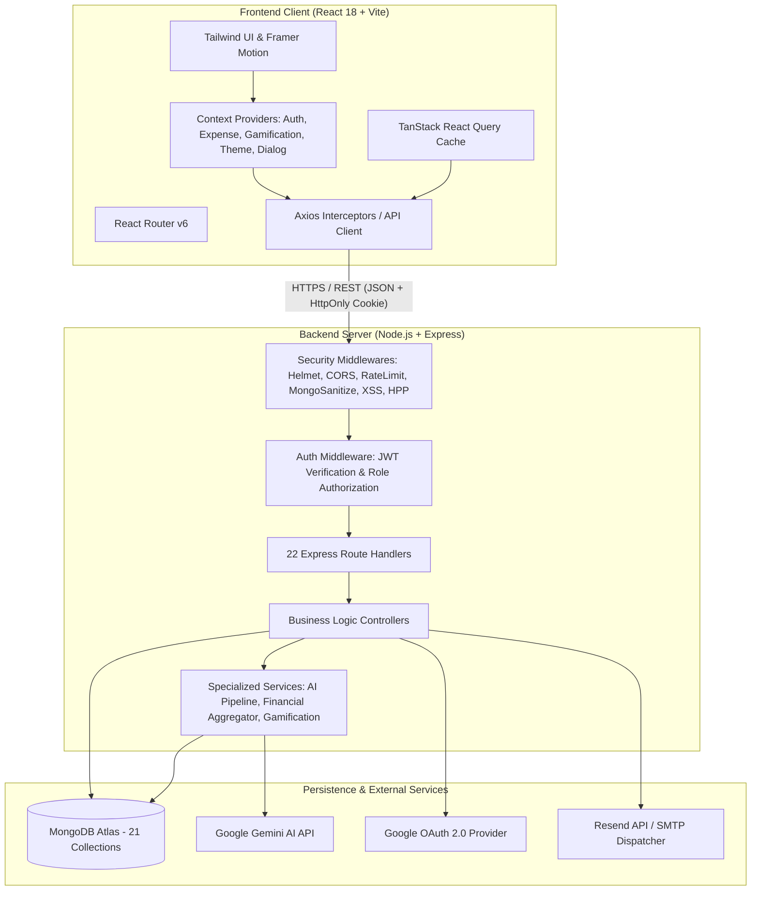
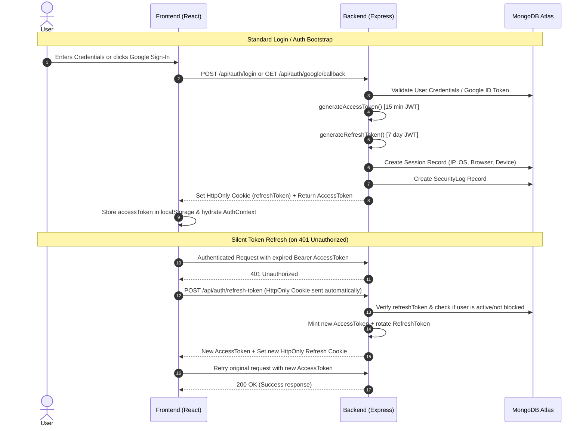
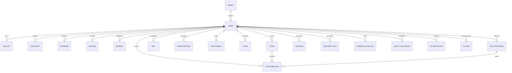

# 🏛️ Expense Tracker — MERN System Architecture

## 1. System Overview

**Expense Tracker** is a full-stack personal financial management and budget planning system built on the **MERN stack** (MongoDB, Express.js, React 18, Node.js). The platform provides transaction tracking, multi-wallet balance management, automated category budgeting, group expense splitting, joint family workspaces, debt and loan tracking, scheduled bill calendars, subscription management, and Google Gemini AI financial insights, supported by an engaging gamification system.

---

## 2. High-Level Architecture

The platform uses a decoupled, 3-tier client-server architecture with secure RESTful communication:



---

## 3. Frontend Architecture

The frontend is a single-page application (SPA) optimized for fast caching, silent token renewal, and responsive data visualizations.

### Core Technologies
* **React 18 & Vite**: Component-driven SPA with fast HMR and optimized production bundles.
* **React Router v6**: Client-side declarative routing with authentication guards (`ProtectedRoute`).
* **Axios & Interceptors**: HTTP client configured with automated token injection and response interceptors that silently refresh expired access tokens upon receiving `401 Unauthorized`.
* **TanStack React Query**: Server state caching, optimistic updates, and background refetching.
* **Framer Motion**: Micro-interactions, modal transitions, achievement toasts, and level-up animations.
* **Recharts**: Financial graphs, budget progress gauges, cash flow charts, and category distribution charts.
* **Tailwind CSS v3**: Utility-first styling with custom dark/light theme support.

### Global Context Providers (`client/src/context/`)
* **`AuthContext`**: Manages authenticated user state, login, logout, profile updates, and cookie-based auth hydration.
* **`ExpenseContext`**: Manages active transactions, filters, pagination, and multi-wallet balance states.
* **`GamificationContext`**: Manages user XP, current level, streak tracking, level-up modals, and daily challenges.
* **`ThemeContext`**: Persists dark and light mode preferences.
* **`DialogContext`**: Provides a global promise-based modal dialog system (`useDialog`).

### Client Hooks (`client/src/hooks/`)
* **`useGoals`**: Handles savings goals CRUD, contribution submissions, and milestone tracking.
* **`useGoalAnalytics`**: Computes completion percentages, remaining days, and contribution histories for goals.
* **`useDialog`**: Dispatches imperative alerts, confirmation modals, and prompt dialogs.

### Client Services (`client/src/services/`)
* **`api.js`**: Axios instance with base URL configuration, timezone offset header attachment, request token injection, and 401 token refresh queue.
* **`goalService.js`**: API helper methods for goal and contribution operations.
* **`rewardService.js`**: Helper methods for calculating rewards, cosmetic items, and badges.

---

## 4. Backend Architecture

The backend is built as a **Modular Express REST API** following a clean separation of concerns across Routes, Middlewares, Controllers, Models, and Services (no unnecessary repository abstractions):

```
HTTP Request
     │
     ▼
[Security Middlewares]  --> Helmet, CORS, Rate Limiters, MongoSanitize, HPP, XSS
     │
     ▼
[Auth Middleware]       --> JWT Bearer validation, Role authorization
     │
     ▼
[Route Router]          --> Maps URL endpoint & HTTP method to Controller
     │
     ▼
[Controller]            --> Validates input (Joi), enforces business logic
     │
     ├──> [Specialized Services] (AI Pipeline, Financial Aggregator, Gamification)
     │
     ▼
[Mongoose Models]       --> Schema validation, indexes, MongoDB persistence
     │
     ▼
HTTP Response           --> Standardized JSON via apiResponse.js
```

---

## 5. Authentication & Session Architecture

The application uses a **Dual-Token Authentication Strategy** designed for maximum security:



---

## 6. Google OAuth 2.0 Flow

Google authentication uses a server-side authorization code flow via `google-auth-library` ensuring that tokens are never exposed in URLs:

```mermaid
sequenceDiagram
    autonumber
    actor User
    participant Browser as Client Browser
    participant API as Backend Server
    participant Google as Google OAuth Server
    participant DB as MongoDB Atlas

    User->>Browser: Clicks "Google" Sign-In Button
    Browser->>API: GET /api/auth/google
    API->>API: Generate random CSRF state (128-bit hex)
    API-->>Browser: Set-Cookie: oauth_state=<state>; HttpOnly; SameSite=Lax
    API-->>Browser: 302 Redirect to Google OAuth Consent Screen
    Browser->>Google: User authenticates with Google
    Google-->>Browser: 302 Redirect to /api/auth/google/callback?code=...&state=...
    Browser->>API: GET /api/auth/google/callback?code=...&state=... (Sends oauth_state cookie)
    API->>API: Verify savedState cookie === query.state & Clear cookie
    API->>Google: Exchange authorization code for tokens
    Google-->>API: Returns ID Token & Access Token
    API->>API: verifyIdToken(idToken, audience=GOOGLE_CLIENT_ID)
    API->>API: Enforce email_verified === true
    API->>DB: Find by googleId OR verified email
    alt User exists
        API->>DB: Link googleId & set authProvider='both' if local
    else New User
        API->>DB: Create User, seed default Categories & primary Wallet
    end
    API->>API: createAuthenticatedSession(user)
    API->>DB: Save Session record (Device, OS, Browser, IP) & SecurityLog
    API-->>Browser: Set-Cookie: refreshToken=...; HttpOnly; Secure; SameSite=None
    API-->>Browser: 302 Redirect to /dashboard (NO tokens or secrets in URL)
    Browser->>API: POST /api/auth/refresh-token (HttpOnly cookie flows automatically)
    API-->>Browser: Returns fresh accessToken
    Browser->>API: GET /api/users/me (Bearer accessToken)
    API-->>Browser: Returns user profile
    Browser->>Browser: Hydrate AuthContext & Display Dashboard
```

### Detailed OAuth Pipeline Breakdown
1. **`GET /api/auth/google` (Initiation)**: Generates a cryptographically secure 128-bit hex CSRF `state` string, sets a signed `oauth_state` HttpOnly cookie, and redirects to Google's OAuth 2.0 consent endpoint with `openid email profile` scopes.
2. **`GET /api/auth/google/callback` (Verification)**: Receives the authorization `code` and `state`. Rejects immediately if the `oauth_state` cookie is missing or mismatched (preventing login CSRF attacks).
3. **ID Token Verification**: Invokes `oauth2Client.verifyIdToken({ idToken, audience: GOOGLE_CLIENT_ID })` to cryptographically validate Google's public key signature, issuer, and expiration.
4. **Email Verification Guard**: Explicitly verifies `email_verified === true` from Google payload before account resolution.
5. **Account Resolution & Linking**:
   * If a user exists with matching `googleId`, logs them in.
   * If an existing user matches the verified `email`, links `googleId` and updates `authProvider` to `'both'` while preserving their existing password, transactions, categories, and account history.
   * If new, creates the `User` (`authProvider: 'google'`), seeding 16 default categories and a primary bank wallet inside a database transaction.
6. **`createAuthenticatedSession()`**: Reuses the core session engine to:
   * Mint a 15-minute JWT access token.
   * Mint a 7-day refresh token saved to the user model.
   * Create an active `Session` document (capturing OS, browser, device name, and IP address).
   * Record a `SecurityLog` entry (`action: 'Google Login Success'`).
   * Set the HttpOnly `refreshToken` cookie (`SameSite=None, Secure=true` in production; `SameSite=Strict` in local development).
7. **Zero-Token Redirect Policy**: Redirects the browser cleanly to `/dashboard` with **ZERO tokens, authorization codes, or user objects in URL query parameters, hash fragments, or headers**.
8. **Client Auth Bootstrap**: Upon arriving at `/dashboard`, `AuthContext` detects that `localStorage` is empty, silently invokes `/api/auth/refresh-token` (the browser sends the HttpOnly cookie automatically), obtains a fresh access token, calls `/api/users/me` to hydrate profile state, and transitions seamlessly to the dashboard.

---

## 7. API Routes Inventory (22 Modules)

| Route Prefix | Controller | Key Responsibilities |
|---|---|---|
| `/api/auth` | `authController.js` | Local register, login, logout, refresh token, password reset, Google OAuth initiation and callback. |
| `/api/users` | `userController.js` | Profile retrieval (`/me`), profile updates, gamification rank stats, active sessions list. |
| `/api/expenses` | `expenseController.js` | Full CRUD operations for expenses, category filtering, wallet deduction. |
| `/api/income` | `incomeController.js` | Full CRUD operations for income streams, wallet balance incrementation. |
| `/api/categories` | `categoryController.js` | Custom user categories CRUD and default categories retrieval. |
| `/api/budgets` | `budgetController.js` | Monthly category spending limits and threshold evaluation. |
| `/api/wallets` | `walletController.js` | Multi-wallet creation, balance adjustments, primary wallet assignment. |
| `/api/goals` | `goalController.js` | Savings goal setup, target date tracking, automated contribution logging. |
| `/api/bills` | `billController.js` | Scheduled and recurring bills tracking, status updates (paid/unpaid). |
| `/api/subscriptions` | `subscriptionController.js` | Recurring subscription management, billing cycle calculations. |
| `/api/investments` | `investmentController.js` | Asset tracking (stocks, mutual funds, gold, real estate). |
| `/api/loans` | `loanController.js` | Debt tracking (lent and borrowed records) with partial repayment logs. |
| `/api/split-bills` | `splitController.js` | Group expense creation, custom contribution amounts, and settlement tracking. |
| `/api/family` | `familyController.js` | Shared family workspace creation, member invites, and pooled budget monitoring. |
| `/api/ai` | `aiController.js` | Google Gemini conversational financial assistant, memory recall, and recommendations. |
| `/api/analytics` | `analyticsController.js` | Spending trends, cash flow analysis, category distribution calculations. |
| `/api/reports` | `reportController.js` | Formatted Excel (`exceljs`) and PDF (`pdfkit`) financial statement exports. |
| `/api/dashboard` | `dashboardController.js` | Aggregated dashboard payloads (summary totals, recent transactions, gauges). |
| `/api/gamification` | `gamificationController.js` | XP progression, leaderboard retrieval, daily challenge completions, reward chest opening. |
| `/api/notifications`| `notificationController.js`| In-app notification history and read status toggles. |
| `/api/sessions` | `sessionController.js` | Active multi-device login tracking and remote session revocation. |
| `/api/admin` | `adminController.js` | Administrative metrics, user management, and system auditing. |

---

## 8. Database Architecture (21 Mongoose Models)

All database entities are modeled in `server/models/`:



### Models Summary
1. **`User`**: Core user credentials, password hash, `googleId`, `authProvider` (`'local'|'google'|'both'`), role, gamification level, XP, coins, streak, season data.
2. **`Wallet`**: Account name, type (`bank|cash|credit|savings`), currency, balance, color, icon, `isPrimary`.
3. **`Category`**: Name, icon, color, type (`expense|income`), user reference.
4. **`Expense`**: Amount, wallet reference, category reference, date, payment method, tags, receipt image.
5. **`Income`**: Amount, wallet reference, category reference, date, description.
6. **`Budget`**: Category reference, monthly spending limit, threshold alerts.
7. **`Goal`**: Title, target amount, current amount, target date, category, status.
8. **`Contribution`**: Goal reference, amount, date, wallet reference.
9. **`Bill`**: Title, amount, due date, category, recurrence, payment status.
10. **`Subscription`**: Service name, cost, billing cycle, renewal date, payment method.
11. **`Investment`**: Asset name, category (`stocks|mutual_funds|crypto|real_estate`), invested amount, current value.
12. **`Loan`**: Counterparty name, type (`lent|borrowed`), total amount, remaining amount, due date, interest rate.
13. **`SplitExpense`**: Title, total amount, paidBy user, split list with settlement flags.
14. **`Family`**: Room name, creator user, member users array, invite code.
15. **`AIChat`**: User reference, multi-turn messages array, metadata tokens.
16. **`Session`**: User reference, token identifier, device name, browser, OS, IP address, `isActive`, `lastActive`.
17. **`SecurityLog`**: User reference, action description, IP address, user agent details, timestamp.
18. **`GamificationLog`**: User reference, action type, XP awarded, coin bonus, reference ID.
19. **`DailyChallengeCompletion`**: User reference, challenge ID, date completed.
20. **`Notification`**: User reference, title, message, type, read status.
21. **`Feedback`**: User reference, feedback type, rating, message.

---

## 9. AI Assistant Architecture

The AI subsystem (`server/services/ai/`) provides factual, personalized advice through a multi-stage validation pipeline:

```
User Prompt
     │
     ▼
[IntentDetector]          --> Detects analytical, transactional, or advisory intent
     │
     ▼
[ContextBuilder]          --> Aggregates user transactions, wallet totals, and budgets
     │
     ▼
[FactRouter]              --> Routes queries to structured aggregators if factual
     │
     ▼
[GeminiService]           --> Invokes Gemini AI (@google/genai) with structured system prompt
     │
     ▼
[ResponseValidator]       --> Hallucination check against real user data & numerical boundaries
     │
     ▼
Sanitized AI Response
```

* **`IntentDetector.js`**: Analyzes natural language messages to extract intent flags.
* **`ContextBuilder.js`**: Gathers relevant user financial snapshots without leaking unrelated data.
* **`GeminiService.js`**: Manages API calls to `@google/genai` using configured models (`gemini-3.5-flash-lite`).
* **`ResponseValidator.js`**: Audits the generated AI response to verify numerical statements match real database records.
* **`InsightEngine.js` & `RiskAnalyzer.js`**: Generates proactive tips and detects unusual spending spikes.

---

## 10. Gamification Architecture

The gamification engine (`server/services/gamificationService.js`) drives continuous user engagement:

* **XP Engine**: Awards XP dynamically based on user activities (logging expenses: +15 XP, meeting budgets: +100 XP, completing daily challenges: +50 XP).
* **Level Progression**: Computes level thresholds using mathematical scaling (`level = floor(sqrt(xp / 100)) + 1`).
* **Streak Tracking**: Tracks consecutive daily activity dates with multiplier bonuses.
* **Reward Chests**: Milestone rewards delivering collectible badges and cosmetics.

---

## 11. Security Architecture

1. **Helmet**: Enforces secure HTTP headers (`Content-Security-Policy`, `X-Frame-Options`, `Strict-Transport-Security`).
2. **CORS Policy**: Restricts API access to authorized frontend origins (`CLIENT_URL` and Vercel domains) with `credentials: true`.
3. **NoSQL Injection Prevention**: `express-mongo-sanitize` strips operator characters (`$`, `.`) from request payloads.
4. **XSS Protection**: `xssSanitizer` recursively purges script tags and HTML entities from request bodies, query strings, and URL parameters.
5. **HTTP Parameter Pollution (HPP)**: Prevents duplicate query parameter attacks.
6. **Tiered Rate Limiting**:
   * Global API throttle: Configurable window per IP.
   * Login throttle: Max 5 failed attempts per 15 minutes.
   * Password Reset / OTP throttle: Max 5 attempts per 10 minutes.
7. **HttpOnly Cookies**: Refresh tokens are inaccessible to JavaScript, eliminating token theft via client-side XSS.

---

## 12. Deployment Architecture

```
                      ┌────────────────────────────┐
                      │    Vercel Cloud Edge       │
                      │  https://expense-tracker-  │
                      │  five-virid-19.vercel.app  │
                      │  (React 18 SPA - dist/)    │
                      └─────────────┬──────────────┘
                                    │ HTTPS (API Requests)
                                    ▼
                      ┌────────────────────────────┐
                      │       Render Cloud         │
                      │  https://expense-tracker-  │
                      │  30el.onrender.com         │
                      │  (Node.js / Express Server)│
                      └─────────────┬──────────────┘
                                    │ Mongoose (TLS)
                                    ▼
                      ┌────────────────────────────┐
                      │     MongoDB Atlas Cloud    │
                      │    Primary/Replica Sets    │
                      └────────────────────────────┘
```

* **Frontend**: Hosted on **Vercel** with automated routing fallbacks (`vercel.json`).
* **Backend**: Hosted on **Render** running in production Node.js mode.
* **Database**: Hosted on **MongoDB Atlas** with encrypted connections (TLS/SSL).
