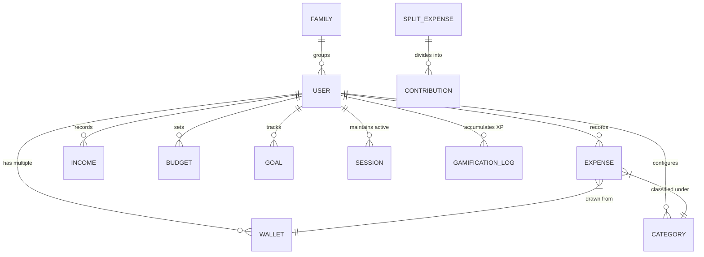

# Expense Tracker — System Architecture (MERN Stack)

## Overview

Expense Tracker is engineered as a robust **3-tier MERN web architecture** built for scalability, responsive financial visualizations, gamified habit formation, multi-wallet synchronization, and proactive AI financial insights.

```text
       +-----------------------------------------------------+
       |               React Frontend (Client)               |
       |  - React 18, Vite, React Router v6, Tailwind CSS    |
       |  - State: Context API & TanStack React Query        |
       |  - Visuals: Recharts & Framer Motion animations     |
       +--------------------------+--------------------------+
                                  |
                      HTTPS / REST API Requests
                                  |
       +--------------------------v--------------------------+
       |               Node.js + Express API Server          |
       |  - Controllers, Routes, & Joi Input Validation      |
       |  - Double JWT: Auth Headers + Secure Refresh Cookie |
       |  - Multi-level Security Middlewares & Winston Logs  |
       +--------------------------+--------------------------+
                                  |
                             Mongoose ODM
                                  |
       +--------------------------v--------------------------+
       |                 MongoDB Database                    |
       |  - 21 Collections representing accounts, wallets,   |
       |    challenges, goals, budgets, and sessions         |
       +-----------------------------------------------------+
```

---

## 💻 Frontend Architecture (`client/`)

The frontend is a single-page application (SPA) built with React 18 and Vite, designed with a focus on high performance, glassmorphic UI aesthetics, accessibility, and resilient state synchronization.

### Core Technologies
* **Vite**: Modern build tool with instant HMR and optimized production bundling.
* **React Router v6**: Declarative client-side routing with route protection (`ProtectedRoute`, `PublicRoute`, and `AdminRoute`).
* **Axios**: HTTP client equipped with interceptors for silent token refreshes via HttpOnly cookies, timezone offset forwarding, and global error handling.
* **TanStack React Query**: Server state synchronization, automatic background caching, optimistic updates, and query invalidation.
* **Framer Motion**: Fluid animations, modal entries/exits, level-up celebrations, and XP progress feedback.
* **Recharts**: Modular SVG charting library powering spending heatmaps, monthly cash flow charts, expense comparisons, and forecasting trends.
* **Tailwind CSS**: Utility-first styling with custom glassmorphism design tokens, dark/light theme switching, and responsive layouts.

### Global Context Providers (`client/src/context/`)
* **AuthContext**: Handles user state, JWT access token cache in memory, registration, login, profile updates, and active session logout.
* **ExpenseContext**: Caches transaction records, custom filters, pagination, category states, and multi-wallet balance states.
* **GamificationContext**: Manages XP progression, current level calculations, level-up modal triggers, reward chest openings, and daily challenges.
* **ThemeContext**: Manages dark/light modes and persists user interface preferences.
* **DialogContext**: Manages global confirm dialogs, alert dialogs, and toast notifications.

---

## ⚙️ Backend Architecture (`server/`)

The backend is constructed with Node.js and Express following the Controller-Service-Repository pattern.

### API Architecture & Route Map

```text
/api
 ├── /auth            --> Register, Login, Refresh token, Active session termination, Password reset
 ├── /users           --> User profile, XP levels, Active sessions audit log, Security logs
 ├── /income          --> CRUD for income streams with wallet and category associations
 ├── /expenses        --> CRUD for expenses with multi-criteria filtering and receipt tagging
 ├── /categories      --> Default system categories & custom user-created categories
 ├── /budgets         --> Monthly limits, category thresholds & alert notifications
 ├── /reports         --> Analytical aggregations, CSV, Excel (.xlsx), and PDF statement generation
 ├── /wallets         --> Accounts creation (Cash, Bank, Card, Savings) & balance recalculation
 ├── /goals           --> Savings goals, milestone tracking & contribution logs
 ├── /investments     --> Investment logs (Stocks, Mutual Funds, Real Estate, Crypto)
 ├── /loans           --> Debt logs (Lent & Borrowed records with repayment schedules)
 ├── /subscriptions   --> Recurring bill schedules and notification triggers
 ├── /notifications   --> User notifications history and mark-as-read handlers
 ├── /ai              --> Google Gemini 2.5/Flash assistant with rate-limiting & caching
 ├── /split-bills     --> Group expense splitting and individual settlement tracking
 ├── /family          --> Shared family budget rooms with role-based member permissions
 ├── /admin           --> Administrative portal, system metrics, user governance & logs
 ├── /sessions        --> Multi-device session audit and remote session revocation
 ├── /analytics       --> Spending trends, category breakdowns, and financial forecasting
 ├── /dashboard       --> Consolidated financial dashboard widgets
 ├── /gamification    --> XP logging, badge verification, streak tracking & challenges
 └── /bills           --> Calendar-scheduled recurring and one-time bill tracking
```

### Security & Sanitization Middlewares
* **Helmet**: Sets robust HTTP security headers (`X-Content-Type-Options`, `X-Frame-Options`, `Strict-Transport-Security`, etc.).
* **Dynamic CORS**: Whitelist-based origin verification supporting production frontend domains, local development origins, and Vercel preview deployments.
* **Rate Limiting**: Multi-tiered rate limiters (`express-rate-limit`) preventing brute force attacks across general APIs, authentication endpoints, and OTP verification routes.
* **Mongo Sanitize**: Sanitizes user inputs against MongoDB query selector injection (`$gt`, `$where`).
* **XSS Sanitizer**: Custom sanitization middleware recursively escaping untrusted HTML and malicious script payloads in bodies, query strings, and params.
* **HPP (HTTP Parameter Pollution)**: Blocks array-based parameter pollution attacks.
* **Central Error Handler**: Formats standard JSON error envelopes without exposing stack traces in production.

---

## 🗄️ Database Architecture (MongoDB)

All data schemas are defined via Mongoose models in `server/models/`.



---

## 📂 Project Structure

```text
expense-tracker/
├── client/                   # Frontend React + Vite Application
│   ├── public/               # Static assets & web manifest
│   ├── src/
│   │   ├── components/       # Reusable UI components
│   │   │   ├── Goals/        # Goal cards, modals, progress rings
│   │   │   ├── ai/           # AI Assistant chat window & markdown renderer
│   │   │   ├── charts/       # Recharts data visualizers & heatmaps
│   │   │   ├── common/       # Navbar, Sidebar, Layout, Dialogs, Modals
│   │   │   ├── gamification/ # Level cards, badges, challenges, streak panels
│   │   │   └── ui/           # Atomic UI library (Button, Card, Input, Select, etc.)
│   │   ├── constants/        # Application constants & challenge pools
│   │   ├── context/          # React Context providers (Auth, Expense, Gamification, Theme)
│   │   ├── hooks/            # Custom React hooks (useGoals, useGoalAnalytics, useDialog)
│   │   ├── pages/            # View pages (Dashboard, Expenses, AI Assistant, etc.)
│   │   ├── services/         # Axios API client & endpoints
│   │   ├── utils/            # Helper calculations & theme formatters
│   │   ├── App.jsx           # Top-level routing & layout wrappers
│   │   ├── index.css         # Tailwind directives & global styling
│   │   └── main.jsx          # DOM entry point
│   ├── .env.example          # Frontend environment variable template
│   ├── package.json          # Client dependencies & scripts
│   └── vite.config.js        # Vite configuration
│
├── server/                   # Backend Express + Node.js Application
│   ├── config/               # Database connection (`db.js`) & Env validation (`env.js`)
│   ├── controllers/          # 22 Route controllers executing business logic
│   ├── middleware/           # Auth, Joi validation, security, and error handling
│   ├── models/               # 21 Mongoose database models
│   ├── routes/               # 22 Express API routers
│   ├── services/             # AI prompt engineering, Gemini integration & gamification
│   ├── utils/                # Winston logger, email sender, token generator, formatters
│   ├── scripts/              # Database seeders, DNS utilities, AI chat deduplication
│   ├── tests/                # Regression tests, AI profiler, session tests
│   ├── server.js             # Express application initialization & server startup
│   ├── .env.example          # Backend environment variable template
│   └── package.json          # Server dependencies & scripts
│
├── docs/                     # Project documentation
│   ├── architecture/         # System architecture & database design
│   ├── deployment/           # Production deployment guide (Vercel + Render)
│   └── api/                  # High-level API overview
│
├── .gitignore                # Git exclusions
├── package.json              # Monorepo root management scripts
└── README.md                 # Primary project README
```
